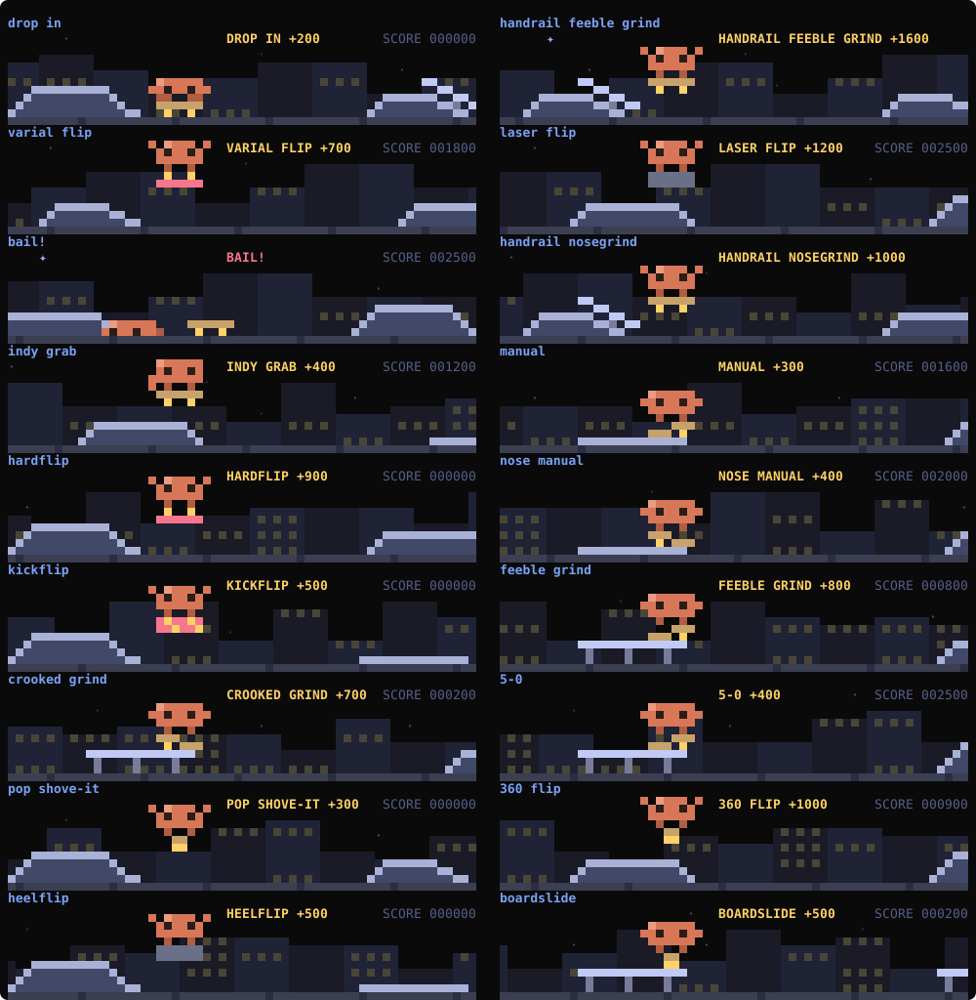

# opencode-spinner: Clawd's little show while opencode works

[简体中文](README.md) · **English** · [Install guide for agents](AGENTS.md)

While opencode 2.0 works, a pixel show plays above the prompt: Clawd, Claude's mascot, busy at his workbench one moment and skating through a skatepark the next. A Clawd pet stands beside it, changing pose and speaking up as the agent thinks, runs tools and answers. When a turn ends, a burst of confetti shows how long it took.

A model writes what he does: while the agent runs `bun test`, Clawd may throw a `LINT GRIND +650` at the park or tinker with a prop the model drew. The random seed comes from whatever your Mac is playing, or from crypto when nothing is.

It started from the `spinner` mod that [hoobnn/hoobnn-agent-mods](https://github.com/hoobnn/hoobnn-agent-mods/tree/main/claude-code/spinner) wrote for Claude Code (MIT), rewritten as an opencode 2.0 TUI plugin.


## The show

A turn is cut into stretches, each one of two kinds, in an order the turn's seed picks, so no two turns look alike.

**The workbench**: Clawd walks in (on foot, on a skateboard, or carrying a parcel), stops somewhere and gets to work, then leaves. What he does comes from 20 vignettes that fit what the agent is doing: a magnifier, a book or a telescope while it searches; a laptop, a quill, paint or code blocks while it edits; an anvil, a cauldron, gears or a rocket launch while a shell command runs; juggling or a wobbling tower while subagents work; thought bubbles, a light bulb, fishing, coffee or a plant while it thinks; a `?` sign while it waits on you. Props the model drew join in.


**The skatepark**: the camera rides along as Clawd skates through a park laid out at random: drop-in decks, funbox pyramids, flat rails, stair sets (some gapped, some with a handrail to grind down), kickers and manual pads. Every obstacle gets a trick, its name and points popping up like in a skate game, with the run's score in the corner:

- flips: ollie, kickflip, heelflip, 360 flip, varial flip, hardflip, laser flip, double kickflip, pop shove-it;
- grabs: melon, indy;
- grinds: 50-50, 5-0, boardslide, nosegrind, crooked, smith, feeble, with sparks;
- manuals, nose manuals and drop-ins;
- hard tricks now and then end in a bail (`BAIL!`, points lost): Clawd hits the ground and the board rolls away.

The model's tricks take most of the obstacles.



While a permission request or a question waits on you, Clawd goes back to his bench and holds up his sign, whatever was playing.

## Content written by a model

On by default. The plugin still draws every frame itself; the model only writes the content, as JSON, which is checked strictly before use (anything malformed, or a copy of the format example, is dropped):

- skatepark tricks: name, how the board turns, points, made up about what the agent is doing (`HANDRAIL REPO GRIND`, `SYNTAX GRAB`);
- workbench scenes: a pixel-art prop in two frames and a caption (in your language).

**When it asks**: there is a chance at each turn's start, then at most every 40 seconds while tools run or the agent thinks. Each chance draws a seed: with fewer than 6 of a kind kept, it always asks (for the kind it has fewer of); with both stocked, the seed decides whether to ask this time (about 35% do). One request at a time, given up after 5 minutes.

**What plays meanwhile**: the request runs in the background while the show plays what is kept, or its own random content when nothing is. The animation never waits.

**Where it is kept**: the latest 12 of each kind, in the plugin's storage (`~/.local/state/opencode/latest/tui/plugin.opencode-spinner.muse.json`), across restarts and shared by every opencode you have open.

**Which model**: the `model` option in `cli.json`:

- unset, or `session` (the default): the current session's own model (`session.generate`). Nothing is added to the session's history, but its context goes along, so the content may be about your project and costs a few more tokens.
- `provider/model-id`, such as `anthropic/claude-haiku-4-5`: that model, called directly (`generate.text`) with a short prompt and no session context. Pick the smallest, fastest one. `opencode models` lists the ids.
- `false` or `"off"`: no model; the show plays its own random content.

opencode's free models (`opencode/…-free`) refuse direct calls from plugins (the server says "free tier can only be used from within OpenCode"); on that error the plugin switches to `session` by itself.

Measured on opencode 2.0.22 with the free `opencode/nemotron-3.5-lightning-free` through `session`: a batch of tricks took about 40 seconds, a batch of workbench props about three and a half minutes, and that model mostly copied the format example (such replies are dropped). A small model with your own key should be much faster (I had none to measure).

## The seed: from sound

On macOS the plugin reads the band levels of whatever the system is playing (levels only: nothing is recorded, written or sent) and stirs them into a seed. The seed picks what the turn plays first, how the parks are laid out and whether to ask the model, and it goes into the model's prompt (along with two theme words it picks, like "space" and "desserts") so each batch comes out different.

With nothing playing, the sound too quiet, no macOS, no `swiftc`, or no recording permission, the seed comes from crypto and everything works the same.

On first use the plugin compiles a small helper from `src/audio-tap.swift` into `~/.cache/opencode-spinner/` (about 2 seconds; it needs macOS 14.2+ and `swiftc`, from `xcode-select --install`), and macOS asks once whether your terminal may record system audio. Set `sound: false` to skip all that.

## The pet

- It changes pose for thinking, running a tool, answering and waiting. Its bubble only says what opencode's own progress line doesn't: the tool running (`shell: npm test`, `edit: themes.ts`), or a permission request or question waiting for you (`❯ Waiting for your OK~`). Subagents running side by side are counted (`subagent ×3`). When the agent runs tests or commits, it says so for a few seconds (tests passed, tests failed, committed).
- Between turns it stays put (done, interrupted, error, and dozing after 5 quiet minutes). Every finished turn, passing test run and commit earns xp and levels (`Lv.4`). Click it, or type `/spinner pet`, to pat it (`♥12`, with floating hearts). Level and affection are kept across sessions, and every opencode you have open raises the same pet.
- With the pet off (`companion: false`), Clawd stands in front of opencode's own progress bar instead (`▐▛█▜▌▭▭ ⬝⬝⬝■■ esc interrupt`).

Also: a finished turn gets confetti and the time taken (`▐▛█▜▌ ✻  Done · 12s`), an interrupted one a sad face, an error a glitchy flicker; under 60 columns or 20 rows the show steps aside and the pet shrinks to one line; the **Spinner** label in the prompt footer turns all animations off and on.

## Install

Requires **opencode 2.x** (tested on 2.0.22) and a truecolor terminal (Ghostty, iTerm2, WezTerm, kitty and so on).

To install it for every project, clone the repository into opencode's plugin folder, then restart opencode:

```bash
git clone --depth 1 https://github.com/zcl0621/opencode-spinner ~/.config/opencode/plugins/opencode-spinner
```

For a single project, clone it into that project's `.opencode/plugins/opencode-spinner` instead.

To set options (another model, say), install it a different way: clone the repository anywhere and list its absolute path with the options in `~/.config/opencode/cli.json` (and don't also put it in a plugin folder):

```json
{
  "plugins": [
    { "package": "/Users/you/src/opencode-spinner", "options": { "model": "anthropic/claude-haiku-4-5", "language": "en" } }
  ]
}
```

To update: `git -C <clone folder> pull`. To uninstall: delete that folder, or that entry in `cli.json`.

## Commands

Just two:

- `/spinner status` (or just `/spinner`): the pet's level and affection, the model, how many tricks and scenes are kept, the last error, and where the seed comes from now.
- `/spinner pet`: pat Clawd.

The command palette (`ctrl+p`) also has **Spinner** and **Spinner: pet Clawd**.

## Options

Under `options` in the plugin's `cli.json` entry, all optional:

| Option | What it does | Default |
| --- | --- | --- |
| `model` | The model that writes content: `session`, `provider/model-id`, or `false` for none | `session` |
| `sound` | Seeds from the sound playing (macOS) | `true` |
| `visible` | Master switch for all animations (the footer's **Spinner** toggles it too, and that is kept) | `true` |
| `footerButton` | The **Spinner** toggle in the prompt footer | `true` |
| `stage` | The show above the prompt | `true` |
| `celebrate` | The finale when a turn ends | `true` |
| `companion` | The pet | `true` |
| `reducedMotion` | Still frames only, still following the state | `false` |
| `language` | Text language: `auto`, `en`, `zh-Hans`, `zh-Hant`, `ja`, `ko`, `es`, `fr`, `de`, `pt-BR`, `ru` | `auto` |

With `language` set to `auto`, the plugin follows the system locale (`LC_ALL`, `LC_MESSAGES`, `LANG`) and falls back to English.

## Development

```bash
bun install
bun run typecheck
bun run test            # = bun test --conditions browser
bun scripts/gallery.ts  # regenerates assets/clawd.svg and assets/skate.svg
```

- `src/plugin.tsx`: the entry point. It claims UI slots (`session.composer.top` for the show and the pet, `prompt.footer.status` for Clawd on the progress line, `prompt.footer` for the toggle) and registers `/spinner`.
- `src/spinner.tsx`: subscribes to opencode's events (`session.execution.*`, `session.tool.*`, `permission.*`, `form.*`) and keeps each session's state, the seed, the pet, and when to ask the model.
- `src/show.ts`: cuts a turn into workbench and skatepark stretches. `src/clawd.ts`: the workbench and its 20 vignettes. `src/skate.ts`: the park, the tricks and the score.
- `src/muse.ts`: the prompts, the strict reading of replies, and whether to ask.
- `src/audio.ts`, `src/audio-tap.swift`, `src/tap.ts`: the sound seed, the system-audio helper, and building and running it.
- `src/themes.ts`, `src/scenes.ts`, `src/pets.ts`, `src/cells.ts`: Clawd's look and the finale, shared layers, the pet, the cell grid. `src/grid.tsx` draws a grid as OpenTUI text.
- `src/i18n.ts`, `src/lang.ts`: messages in each language.

Any file that imports `solid-js` must be a `.tsx` file. opencode only redirects modules for `.tsx` files; a `.ts` file gets a second copy of Solid, and the UI stops updating.

## Credits

The pet, the workbench art and the messages build on [hoobnn](https://github.com/hoobnn)'s [hoobnn-agent-mods](https://github.com/hoobnn/hoobnn-agent-mods) (MIT). This repository is also MIT; see [LICENSE](LICENSE).
