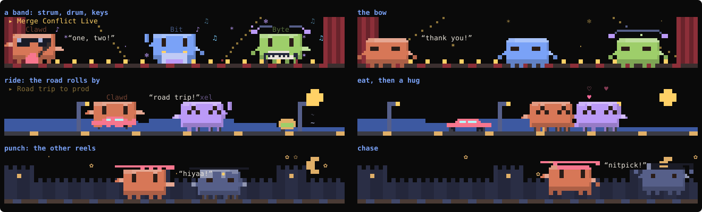
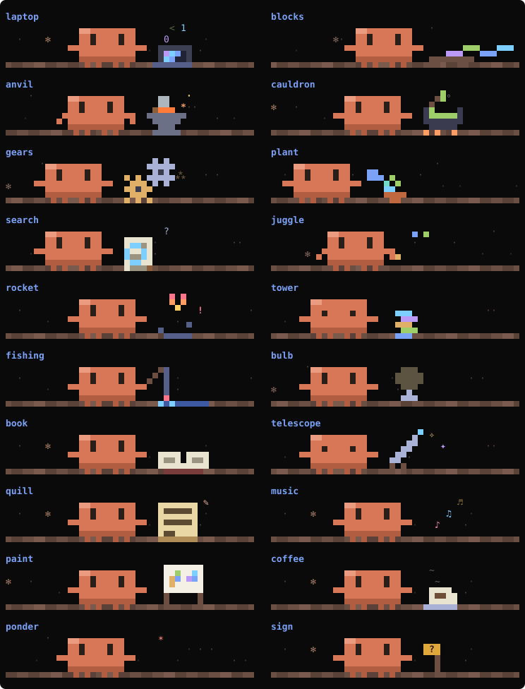
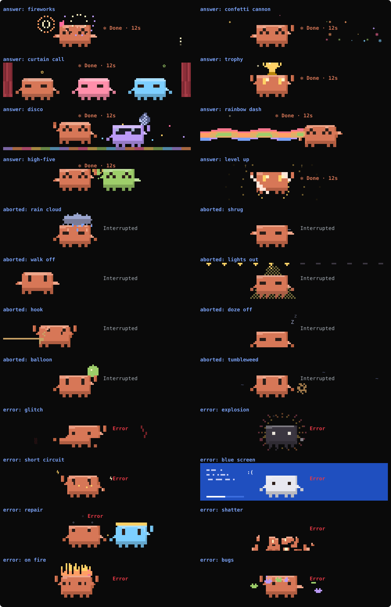

# opencode-spinner

A pixel theater that plays above the prompt while opencode 2.x works.

The stars are Clawd, Claude's mascot, and up to two more Clawds in other colors. A model writes short skits about what the agent is doing right now (thinking, searching, editing, running a command, sending out subagents), and the plugin acts them out: a band on stage, a road trip, a kung fu fight, a heist. Between skits Clawd works at his bench. A Clawd pet stands beside the show and reports what's going on. When a turn ends, one of 24 short finales plays next to the time it took.


It started from the `spinner` mod that [hoobnn/hoobnn-agent-mods](https://github.com/hoobnn/hoobnn-agent-mods/tree/main/claude-code/spinner) wrote for Claude Code (MIT), and was rewritten as an opencode TUI plugin.

## Quick start

You need opencode 2.x (tested on 2.0.22 and 2.0.23) and a truecolor terminal such as Ghostty, iTerm2, WezTerm or kitty.

```bash
git clone --depth 1 https://github.com/zcl0621/opencode-spinner ~/.config/opencode/plugins/opencode-spinner
```

Restart opencode and send a message. That's it: the show uses your session's own model to write skits, so there is nothing to configure.

For one project only, clone into that project's `.opencode/plugins/opencode-spinner` instead. To set options, see [Options](#options). Installing it for someone else? Agents can follow [INSTALL.md](INSTALL.md), which has the full steps with checks and fixes.

## The show

The show is six rows tall. It follows what the agent is doing, but holds each kind of work for at least six seconds, so a quick tool call doesn't cut a skit short. When the agent settles into new work, a skit about that work comes on. After it, more skits and bench visits take turns, in an order the turn's seed picks.

### Skits

A skit is a small script in JSON. The model writes it; the plugin checks it and draws every frame. Each skit has a title, a cast of one to three Clawds, a place, up to four props, up to four moves of its own and two to ten beats.

Each Clawd has a name, a body color and a look: eyes (happy, closed, dizzy, hearts, shades, stars), a hat and something to hold, drawn by the model in pixels, and now and then a holographic shimmer.

The place is a backdrop, something in the sky and some weather, in the model's colors. There are 21 backdrops (city, hills, mountains, forest, sea, desert, space, snow, room, concert stage, road, beach, library, castle, cave, sea floor, kitchen, stadium, haunted yard, jungle, classroom), six skies (moon, sun, planet, clouds, rainbow, UFO) and ten weathers (stars, rain, snow, leaves, fireflies, bubbles, sakura, confetti, fog, embers).

Props are pixel art the model draws: instruments, cars, food, animals, anything. They can bob, float, fall, spin, blink, shake, orbit, grow, dance, hop, pace, sway or flap, and keep an effect going, like notes over a jukebox or smoke over a pot.

In each beat every Clawd can act at once; the ones with nothing to do turn to watch. There are 71 built-in actions:

- move: walk, run, jump, sneak, march, crawl, roll, flip, fly, swim, teleport, or ride a prop while the world rolls by
- strike a pose: wave, cheer, clap, point, nod, shake his head, salute, bow, spin, dance, sing, laugh, cry, stretch, think, look, sit, sleep, meditate (floating), shiver, panic, fall over, faint, kneel, hide behind a prop
- use his hands: work, dig, paint, read, eat (the food shrinks), drink, hold something up, call on a phone, type, stir a pot, sweep, juggle, take a photo, climb on top of a prop, cast a spell
- play music: strum a guitar, drum, blow a horn, play keys, each with its own arm moves
- handle props: carry one overhead, throw it, push it, kick it
- deal with another Clawd: high-five, hug, shake hands, argue, waltz, lift him overhead, scare him (he jumps), chase or follow him, punch or kick him (he reels), throw him something (he catches it), put a spell on him

When none of those fits, the model can make up its own moves for a skit: a moonwalk, a robot dance, a victory stomp. A move is up to eight poses played in a loop, each setting both arms, the legs, how high he is off the floor, a nudge sideways, crouching, which way he faces and his eyes. The plugin checks every value and plays it like any other action, travelling across the stage if the act gives a destination.

A beat can set off an effect (sparks, hearts, notes, zzz, steam, confetti, stars, bubbles, lightning, smoke, rain, `?`, `!`, an impact, dust, a thought bubble, tears, fire, wind), and any Clawd can say a line in your language. Many actions bring their own effect: notes for music, dust for running, an impact for a punch.

Every skit is asked to tell a small story: a setup, then trouble or a twist (something breaks, a rival shows up, a plan goes wrong), then a fix or a punchline. A beat can carry a narrator's caption ("Later that night...", "Plot twist!"), shown at the top right while it plays.

Skits also form a running series. The first skit of every batch is the next episode: the request recalls the last three episodes (each skit comes with a one-sentence summary) and the regular cast, and asks the model to pick up from there. Returning regulars keep their names, colors and outfits, and the title shows the episode number (`▸ Ep.5 ...`). The second skit of a batch stands on its own. What happened in your session in the last 30 minutes (tests failing or passing, commits, a turn that errored or was interrupted) goes into the request too, to become the episode's trouble, twist or ending. Episodes are written for different kinds of work, so the show may play them out of order.

To keep batches varied, each request asks for two very different skits and names a kind of scene from films, novels and shows to stage one of them like: a rock concert, a heist, a western showdown, a cooking show, a haunted house, a rom-com meet-cute, and 28 more.

A skit runs 8 to 36 seconds. These four are hand-written samples (real ones come from the model); the last one uses two made-up moves:



### The bench

The default scene, and what plays before any skits exist. Clawd walks in on foot, on a skateboard or carrying a parcel, gets to work, then leaves. He picks from 20 vignettes that fit the work: a magnifier or telescope while the agent searches, a laptop or quill while it edits, an anvil, a cauldron or a rocket while a command runs, juggling while subagents work, a light bulb, fishing or coffee while it thinks.



While a permission request or a question waits on you, Clawd goes to his bench and holds up a `?` sign.

## Finales

When a turn ends, a four-second pixel finale plays next to the time taken (`✻ Done · 12s`). Each outcome has eight, and which one you get follows the turn, so two turns in a row rarely match.

- Done: fireworks, a confetti cannon, a curtain call with the whole cast, a trophy, a disco ball, a rainbow dash, a high five, a level-up glow.
- Interrupted: a rain cloud, a shrug, a walk-off, the stage lights going out, a vaudeville hook, dozing off, a balloon going flat, a tumbleweed.
- Error: a glitch, an explosion, a short circuit, a blue screen, a mechanic Clawd hammering him back together, shattering, his head catching fire, a swarm of bugs.



## The pet

The pet changes pose for thinking, running a tool, answering and waiting. Its speech bubble only says what opencode's own progress line doesn't: the tool running (`shell: npm test`, `edit: themes.ts`), how many subagents are out (`subagent ×3`), or that something waits for you (`❯ Waiting for your OK~`). When the agent runs tests or commits, it says how that went for a few seconds.

Each turn it wears a new outfit: a party hat, a crown, a beanie, a top hat, headphones, a flower, a chef's hat, a coffee or a wand, or about half the time something from a skit the model wrote. Between turns it shows how the last one ended and dozes off after 5 quiet minutes.

Finished turns, passing tests and commits earn it xp and levels (`Lv.4`). Click it or type `/spinner pet` to pat it (`♥12`, with floating hearts). Level and affection are kept across sessions, and every opencode you have open raises the same pet.

With the pet off (`companion: false`), Clawd stands in front of opencode's progress bar instead (`▐▛█▜▌▭▭ ⬝⬝⬝■■ esc interrupt`).

Under 60 columns or 20 rows the show steps aside and the pet shrinks to one line. The **Spinner** label in the prompt footer turns all animation off and on.

## Pixels

Where the terminal can draw them, the show uses octant characters (Unicode 16), which fit 2 × 4 pixels in a cell, twice the detail of half blocks each way. Ghostty draws octants itself, so they're on there by default. Other terminals get half blocks unless you set `pixels: "fine"`. To check yours, run this and look for five small block shapes, not boxes:

```bash
printf '\U0001CD00\U0001CD01\U0001CD0B\U0001CD5F\U0001CDE5\n'
```

## The model behind the skits

### Which model

Set the `model` option:

- `session` (the default): the current session's model, through `session.generate`. Nothing goes into the session's history, but its context goes along, so skits may be about your project and cost a few more tokens.
- `provider/model-id`, such as `anthropic/claude-haiku-4-5`: that model, called directly with a short prompt and no session context. Pick the smallest, fastest one you have; `opencode models` lists the ids. The plugin uses the model's lightest reasoning variant (the first of `none`, `off`, `minimal`, `low` it has).
- `false` or `"off"`: no model. The show plays the bench.

opencode's free models (`opencode/…-free`) refuse direct calls from plugins ("free tier can only be used from within OpenCode"). On that error the plugin switches to `session` by itself. Through `session`, the plugin can't change the model's reasoning; the prompt only asks it not to think long.

On opencode 2.0.22 with the free `opencode/nemotron-3.5-lightning-free` through `session`, one batch of two skits took a few minutes (not timed exactly), and its art was simple. Its JSON is often malformed; the plugin repairs what it can. A small model with your own key should be faster and draw better, but I haven't measured one.

### When it asks

There is a chance at the start of each turn, then at most every 40 seconds while the agent works. Each chance asks for skits about the work at that moment: always when fewer than 3 are kept for that kind of work, otherwise about 35% of the time. One request runs at a time, in the background, and is dropped after 5 minutes. The show never waits for it.

The latest 500 skits are kept in `~/.local/state/opencode/latest/tui/plugin.opencode-spinner.muse.json`. They survive restarts and are shared by every opencode you have open.

### What the plugin checks

The model only writes JSON. Before a skit plays, the plugin bounds its length, cast, actions, effects, colors and pixel art. An act missing what it needs becomes a plain one (a `ride` with no vehicle is a walk), and props copied from the format example are dropped. Skits kept by earlier versions still play.

## The seed comes from sound

On macOS the plugin reads the band levels of whatever the system is playing and stirs them into a seed. It reads levels only; nothing is recorded, written or sent. The seed picks which skits play and when, whether to ask the model, and goes into the prompt with two theme words (like "space" and "desserts") so each batch comes out different.

With nothing playing, or without macOS, `swiftc` or recording permission, the seed comes from crypto and everything works the same.

On first use the plugin compiles a small helper from `src/audio-tap.swift` into `~/.cache/opencode-spinner/`. It takes about 2 seconds and needs macOS 14.2+ and `swiftc` (`xcode-select --install`). macOS then asks once whether your terminal may record system audio. Set `sound: false` to skip all of this.

## Commands

- `/spinner status` (or just `/spinner`): the pet's level and affection, the model and reasoning variant in use, how many skits are kept, the last error, and where the seed comes from.
- `/spinner pet`: pat Clawd.

The command palette (`ctrl+p`) also has **Spinner** and **Spinner: pet Clawd**.

## Options

To set options, clone the repository anywhere (not into a plugin folder) and list its absolute path in `~/.config/opencode/cli.json`:

```json
{
  "plugins": [
    { "package": "/Users/you/src/opencode-spinner", "options": { "model": "anthropic/claude-haiku-4-5", "language": "en" } }
  ]
}
```

All options are optional.

| Option | What it does | Default |
| --- | --- | --- |
| `model` | Who writes the skits: `session`, `provider/model-id`, or `false` for none | `session` |
| `sound` | Seed from the sound playing (macOS) | `true` |
| `visible` | Master switch for all animation. The footer's **Spinner** toggles it too, and that choice is kept | `true` |
| `footerButton` | The **Spinner** toggle in the prompt footer | `true` |
| `stage` | The show above the prompt | `true` |
| `celebrate` | The finale when a turn ends | `true` |
| `companion` | The pet | `true` |
| `reducedMotion` | Still frames only, still following the state | `false` |
| `language` | `auto`, `en`, `zh-Hans`, `zh-Hant`, `ja`, `ko`, `es`, `fr`, `de`, `pt-BR`, `ru` | `auto` |
| `pixels` | `fine` (octants), `coarse` (half blocks), or `auto`: fine in Ghostty, coarse elsewhere | `auto` |

With `language: "auto"` the plugin follows the system locale (`LC_ALL`, `LC_MESSAGES`, `LANG`) and falls back to English.

To update, run `git -C <clone folder> pull`. To uninstall, delete the folder or the `cli.json` entry.

## Development

```bash
bun install
bun run typecheck
bun run test            # = bun test --conditions browser
bun scripts/gallery.ts  # regenerates assets/clawd.svg, assets/theater.svg and assets/finale.svg
```

To try changes live, symlink the repo into a test project's `.opencode/plugins/` and run opencode there; plugins hot-reload on save.

- `src/plugin.tsx` is the entry point. It claims the UI slots (`session.composer.top` for the show and pet, `prompt.footer.status` for Clawd on the progress line, `prompt.footer` for the toggle) and registers `/spinner`.
- `src/spinner.tsx` listens to opencode's events (`session.execution.*`, `session.tool.*`, `permission.*`, `form.*`) and keeps each session's state, the seed, the pet, and when to ask the model.
- `src/show.ts` decides what plays when. `src/stage.ts` acts skits out, `src/place.ts` draws their places, `src/clawd.ts` draws Clawd and the bench.
- `src/muse.ts` holds the skit format, the prompt, and the strict (and forgiving) reading of replies.
- `src/finale.ts` draws the finales, `src/pets.ts` the pet, `src/cells.ts` the pixel canvas. `src/themes.ts` and `src/scenes.ts` hold the theme and shared layers; `src/grid.tsx` turns a grid into OpenTUI text.
- `src/audio.ts`, `src/audio-tap.swift` and `src/tap.ts` are the sound seed and its helper.
- `src/i18n.ts` and `src/lang.ts` hold the messages in each language.

Any file that imports `solid-js` must be `.tsx`. opencode only redirects modules for `.tsx` files; a `.ts` file gets a second copy of Solid and the UI stops updating.

## Credits

The pet, the workbench art and the messages build on [hoobnn](https://github.com/hoobnn)'s [hoobnn-agent-mods](https://github.com/hoobnn/hoobnn-agent-mods) (MIT). This repository is MIT too; see [LICENSE](LICENSE).
