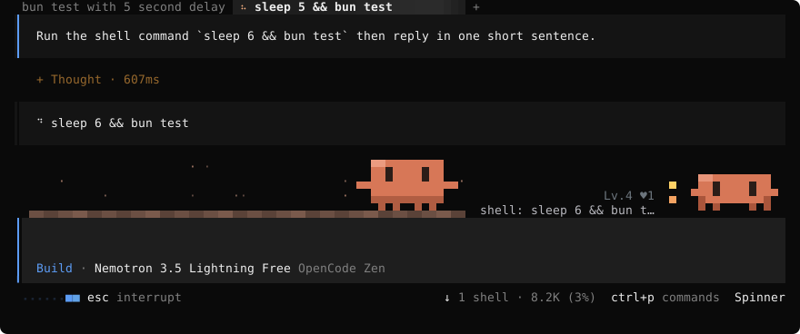
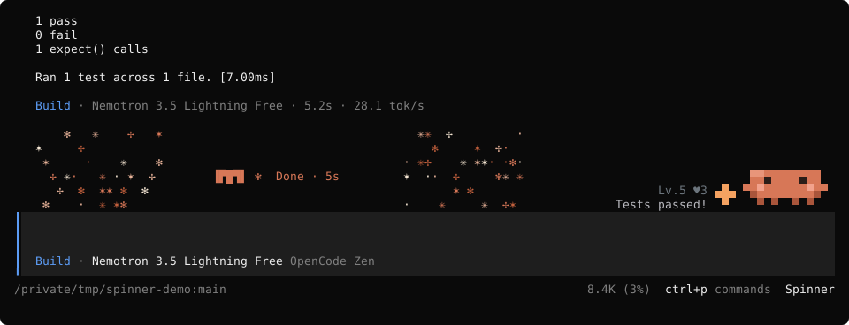
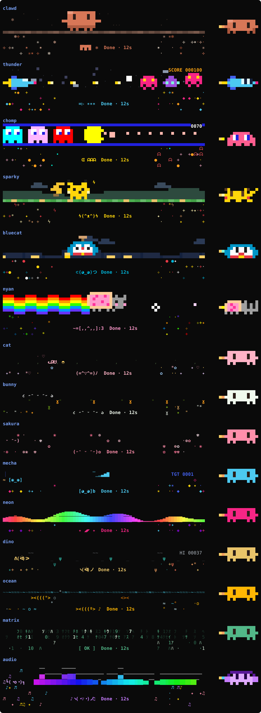

# opencode-spinner：opencode 运行动画与宠物伴侣

**简体中文** · [English](README.en.md) · [给 agent 的安装指引](AGENTS.md)

opencode 2.0 干活时，输入框上方会演一段小动画：像素风的横版射击、Clawd、吃豆人、彩虹猫……旁边还有一只宠物，跟着 agent 的动作换姿势、冒气泡。一轮结束放一小段彩带，显示这轮用了多久。共 15 套主题，其中一套把电脑正在播放的声音画成频谱。

移植自 [hoobnn/hoobnn-agent-mods](https://github.com/hoobnn/hoobnn-agent-mods/tree/main/claude-code/spinner) 里给 Claude Code 写的 `spinner` mod（MIT）。主题、宠物和动画的绘制代码原样保留，接入 opencode 的部分重写成了 opencode 2.0 的 TUI 插件。





## 功能

- **动画场景**：agent 工作时，输入框上方播放主题动画。
- **宠物伴侣**：按思考、调用工具、输出、等待切换姿势。气泡只说 opencode 自己的进度行没有的信息：正在跑的工具（`shell: npm test`、`edit: themes.ts`），或者有权限请求、问题在等你回答（`❯ 等你确认一下～`）。多个子代理并行时显示数量（`subagent ×3`）。agent 跑测试或提交时，它会说几秒钟（测试通过、测试没过、提交好了）。
- **养成**：两轮之间宠物留在原地（完成、被中断、出错，安静 5 分钟后打瞌睡）。每跑完一轮、每次测试通过、每次提交都会涨经验升级（`Lv.4`）；点它或输入 `/spinner pet` 可以摸摸它（`♥12`，会冒爱心）。等级和好感度跨会话保存，同时开的几个 opencode 养的是同一只。
- **进度行上的吉祥物**：关掉宠物（`/spinner companion off`）后，吉祥物会站到 opencode 自己的进度条前面（`▐▛█▜▌▭▭ ⬝⬝⬝■■ esc interrupt`）。同一时间只显示一个吉祥物。
- **完成庆祝**：一轮结束，吉祥物身边放彩带并显示用时（`▐▛█▜▌ ✻  完成 · 12s`）；被中断是一张难过的脸，出错是一阵故障闪烁。
- **窄终端**：不足 60 列或 20 行时，场景收起，宠物缩成一行（吉祥物、气泡和等级）。
- **减少动画**：打开 `reducedMotion` 后，所有动画只画静止的一帧，但仍随状态变化。
- **底栏开关**：输入框底栏有个 **Spinner**，点一下开关全部动画。

## 主题



像素风场景（三行半格像素）：

- `clawd`：Claude 的吉祥物 Clawd 散步路过，停下来干活，身边转着星芒；跑工具时敲笔记本，等你确认时头上冒 `?`。
- `thunder`：雷霆战机式横版射击，战机自动瞄准一波波敌机，有爆炸和计分；跑工具时敌机来得更快。
- `chomp`：吃豆人被四只幽灵追着跑，直到吞下能量豆。
- `sparky`：电气鼠一路冲过去，脸颊噼啪放电，跑工具时落下闪电。
- `bluecat`：蓝色机器猫戴着竹蜻蜓飞，跑工具时口袋里掉出道具。
- `nyan`：彩虹猫拖着彩虹飞过星空。

角色场景（两行）：`cat`、`bunny`、`sakura`、`mecha`、`neon`、`dino`、`ocean`、`matrix`。也可以选 `random`，每次启动 opencode 随机一套。

声音场景（四行）：`audio` 把 Mac 正在播放的声音实时画成频谱，左边的小人踩着节拍跳舞。有声音时两轮之间也会显示。`random` 不会抽到它，要按名字选。需要 macOS 14.2+ 和 `swiftc`（`xcode-select --install`）。第一次用时插件用 `src/audio-tap.swift` 编译一个小程序到 `~/.cache/opencode-spinner/`（约 2 秒），只在这套主题显示时运行：通过 Core Audio 读取系统输出的各频段电平，不保存、不写盘、不外传。macOS 会询问一次是否允许终端录制系统音频。读不到声音时小人睡着，`/spinner status` 会说明原因。

`chomp`、`sparky`、`bluecat`、`nyan` 是原作者从零绘制、另起名字的同人致敬。

## 安装

需要 **opencode 2.x**（在 2.0.22 上测试过）和支持真彩色的终端（Ghostty、iTerm2、WezTerm、kitty 等）。

全局安装（所有项目都生效），把仓库克隆进 opencode 的插件目录：

```bash
git clone --depth 1 https://github.com/zcl0621/opencode-spinner ~/.config/opencode/plugins/opencode-spinner
```

然后重启 opencode。只想在某个项目里用，就克隆到项目的 `.opencode/plugins/opencode-spinner`。

要改选项，换一种装法：仓库克隆到任意位置，在 `~/.config/opencode/cli.json` 里写上绝对路径和选项（这时不要再放进插件目录）：

```json
{
  "plugins": [
    { "package": "/Users/you/src/opencode-spinner", "options": { "theme": "clawd", "language": "zh-Hans" } }
  ]
}
```

更新：`git -C <克隆的目录> pull`。卸载：删掉那个目录或 `cli.json` 里那一项。

## 命令

- `/spinner status`（或只输入 `/spinner`）：当前主题、宠物的等级和好感度、主题列表。
- `/spinner <主题>`、`/spinner random`：切换主题；`/spinner theme` 弹出列表选择（可以搜索）。
- `/spinner preview [主题]`：在输入框上方试播 8 秒。
- `/spinner pet`：摸摸宠物。
- `/spinner off` / `on`：关闭或打开全部动画；`/spinner stage off` / `on` 只管动画场景；`/spinner companion off` / `on` 只管宠物。

命令改的设置保存在插件自己的存储里，重启后沿用，并且优先于 `cli.json` 里的选项。命令面板（`ctrl+p`）里也有 **Spinner**、**Spinner: pick a theme** 和 **Spinner: pet the companion**。

## 选项

写在 `cli.json` 那一项的 `options` 里：

| 选项 | 作用 | 默认 |
| --- | --- | --- |
| `theme` | 主题，或 `random` | `random` |
| `visible` | 全部动画的总开关 | `true` |
| `footerButton` | 输入框底栏的 **Spinner** 开关 | `true` |
| `stage` | 输入框上方的动画场景 | `true` |
| `celebrate` | 一轮结束时的庆祝动画 | `true` |
| `companion` | 宠物伴侣 | `true` |
| `reducedMotion` | 只画静止画面，仍随状态变化 | `false` |
| `language` | 文字语言：`auto`、`en`、`zh-Hans`、`zh-Hant`、`ja`、`ko`、`es`、`fr`、`de`、`pt-BR`、`ru` | `auto` |

`language` 为 `auto` 时跟随系统语言环境（`LC_ALL`、`LC_MESSAGES`、`LANG`），都没有时用英语。

## 和 Claude Code 版的区别

- `/spinner` 的回复用 opencode 的弹窗和 toast 显示，不进对话。`/spinner theme` 用 opencode 的可搜索列表，所有主题都在里面。
- 选项写在 `cli.json`，不在 `/config`；命令的改动存在插件存储里，不回写配置文件。
- `random` 每次启动 opencode 抽一次（热重载不换）。
- 语言 `auto` 只看系统语言环境（opencode 没有对应的语言设置）。
- 原版和 `hud` mod 配合的部分（把宠物放进 HUD）没有搬，opencode 里没有那个 mod。

## 开发

```bash
bun install
bun run typecheck
bun run test          # = bun test --conditions browser
bun scripts/gallery.ts  # 重新生成 assets/gallery.svg
```

- `src/plugin.tsx`：插件入口，注册界面槽位（`session.composer.top` 放场景和宠物，`prompt.footer.status` 放进度行上的吉祥物，`prompt.footer` 放开关）和 `/spinner` 命令。
- `src/spinner.tsx`：订阅 opencode 的事件（`session.execution.*`、`session.tool.*`、`permission.*`、`form.*`），维护每个会话的状态、宠物、设置和声音小程序。
- `src/themes.ts`、`src/scenes.ts`、`src/pets.ts`、`src/cells.ts`：主题、场景、宠物和字符网格，从原版原样搬来；`src/grid.tsx` 把网格画成 OpenTUI 文本。
- `src/audio.ts`、`src/audio-tap.swift`、`src/tap.ts`：`audio` 主题的电平处理、读取系统音频的小程序和它的编译与启动。
- `src/i18n.ts`、`src/lang.ts`：各语言文案。

注意：导入 `solid-js` 的文件必须是 `.tsx`。opencode 只对 `.tsx` 做模块重定向，`.ts` 文件会拿到另一份 Solid，界面就不会刷新。

## 致谢

主题、宠物、动画和文案来自 [hoobnn](https://github.com/hoobnn) 的 [hoobnn-agent-mods](https://github.com/hoobnn/hoobnn-agent-mods)（MIT）。本仓库同样以 MIT 发布，见 [LICENSE](LICENSE)。
